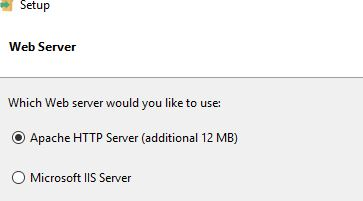
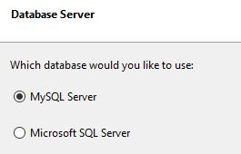
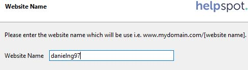
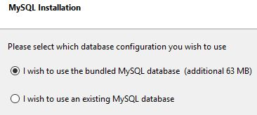
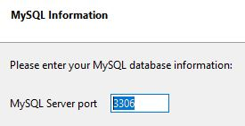
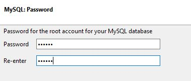
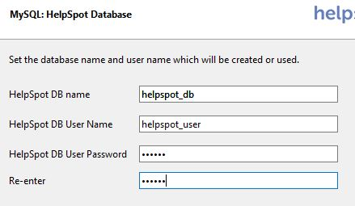

# Evaluación y documentación de HelpSpot

## Instalación HelpSpot
1) Empezamos con la instalación del HelpSpot, seleccionamos servidor Apache

2) Elegimos la base de datos que queramos, en este caso MySQL Server

3) Ponemos nombre al sitio web

4) Seleccionamos si queremos una base de datos existente o crear una

5) Ponemos el número de puerto que queramos para el servidor

6) Establecemos una contraseña root para la base de datos

7) Y finalmente, ponemos un nombre a la base de datos, un usuario y contraseña

